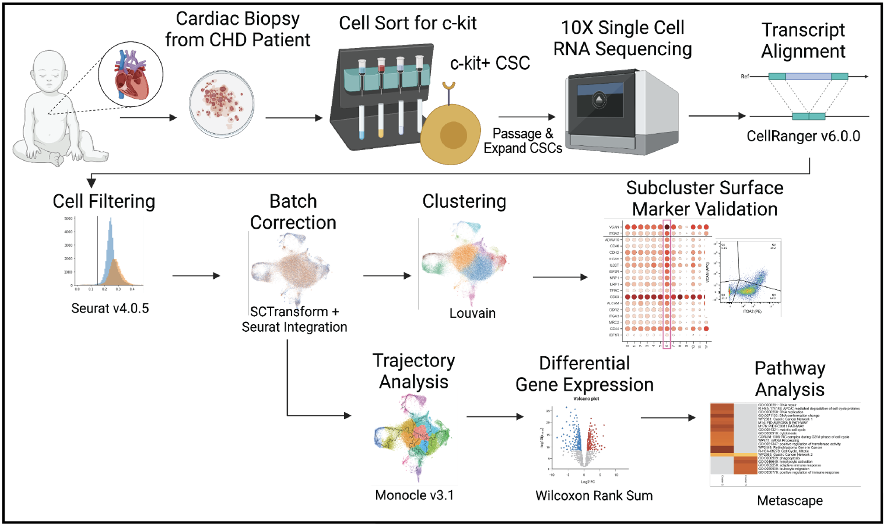

# Single-Cell RNA Sequencing Reveals Distinct Cardiac-Derived Stromal Cell Subpopulations
## Code for Hoffman and Jayaraman CPC scRNAseq manuscript
### [Manuscript](https://www.mdpi.com/2308-3425/9/11/374)
### Deposited data: [GSE204928](https://www.ncbi.nlm.nih.gov/geo/query/acc.cgi?acc=GSE204928)

### Abstract: 
Human cardiac-derived c-kit+ stromal cells (CSCs) have demonstrated efficacy in preclinical trials for the treatment of heart failure and myocardial dysfunction. Unfortunately, large variability in patient outcomes and cell populations remains a problem. Previous research has demonstrated that the reparative capacity of CSCs may be linked to the age of the cells: CSCs derived from neonate patients increase cardiac function and reduce fibrosis. However, age-dependent differences between CSC populations have primarily been explored with bulk sequencing methods. In this work, we hypothesized that differences in CSC populations and subsequent cell therapy outcomes may arise from differing cell subtypes within donor CSC samples. We performed single-cell RNA sequencing on four neonatal CSC (nCSC) and five child CSC (cCSC) samples. Subcluster analysis revealed cCSC-enriched clusters upregulated in several fibrosis- and immune response-related genes. Module-based analysis identified upregulation of chemotaxis and ribosomal activity-related genes in nCSCs and upregulation of immune response and fiber synthesis genes in cCSCs. Further, we identified versican and integrin alpha 2 as potential markers for a fibrotic cell subtype. By investigating differences in patient-derived CSC populations at the single-cell level, this research aims to identify and characterize CSC subtypes to better optimize CSC-based therapy and improve patient outcomes.
